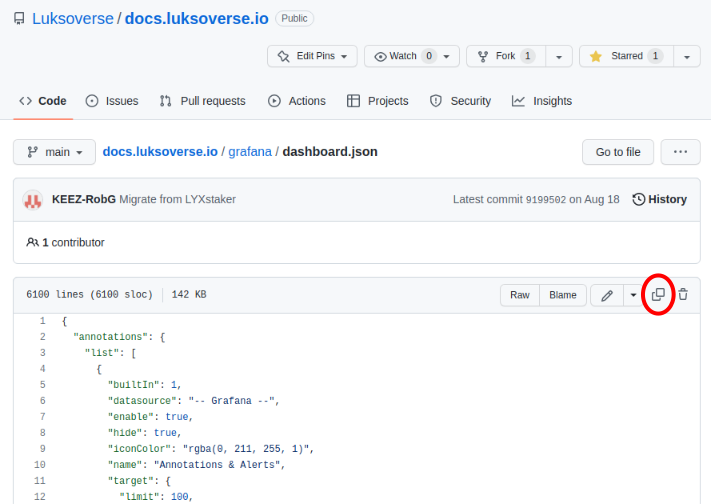
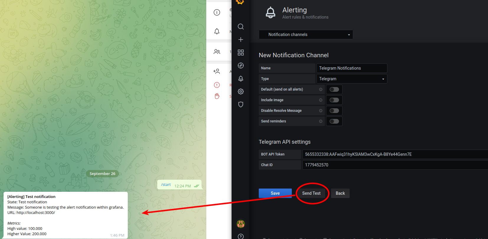
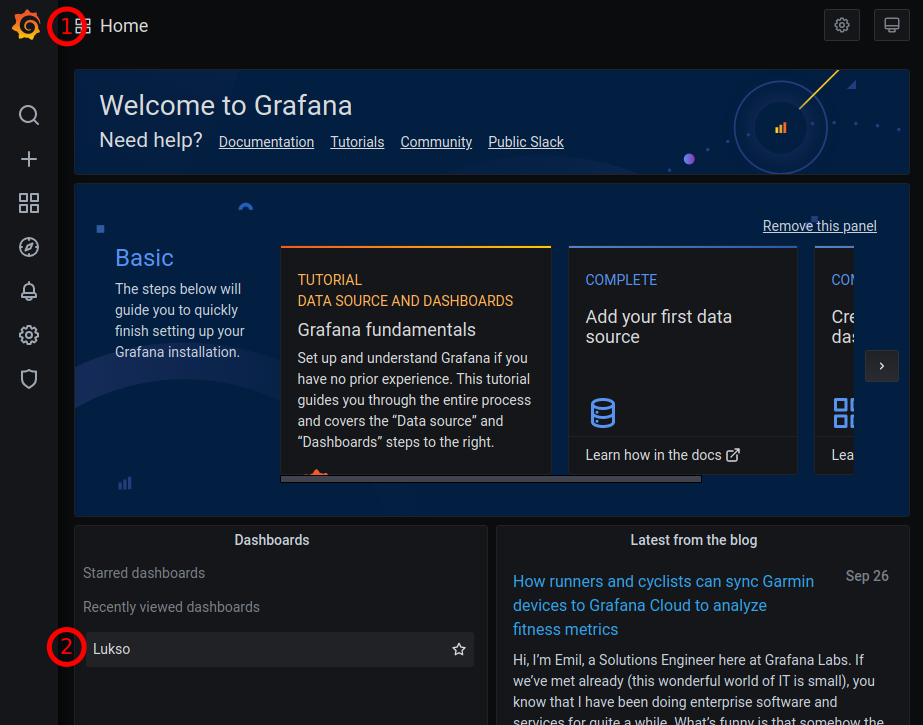
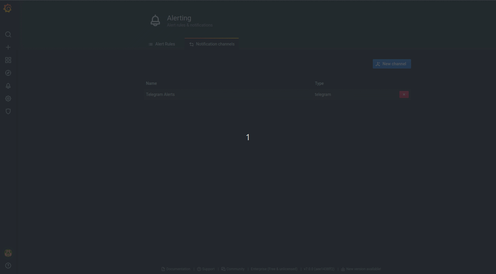

import Tabs from '@theme/Tabs';
import TabItem from '@theme/TabItem';

# Part 5 - Monitoring

This guide will show you step by step how to do monitoring on your machine by giving you the instructions to install and configure all the tools needed.

## Why would you want to do monitoring?

Here are some good reasons why you might want to do monitoring on your machine:

1. **Information visibility**: You want to expose and be able to easily see your machine details.
2. **Issue tracking and debugging**: You want to be able to inspect what happened in the past and see clearly how your machine reacted to some event.
3. **Issue prevention**: You want to be able to see potential resources exhaustion ahead of time.

## Overview

We will install 5 tools with this guide:

- [Node Exporter](https://prometheus.io/docs/guides/node-exporter/) - monitors the node machine's performance

- [JSON Exporter](https://github.com/prometheus-community/json_exporter) - scrapes LUKSO price information from CoinGecko.

- [Blackbox Exporter](https://github.com/prometheus/blackbox_exporter) - monitors ping time between the node machine and two DNS servers.

- [Prometheus](https://prometheus.io/docs/introduction/overview/) - collects metrics from the node, JSON and Blackbox exporters.

- [Grafana](https://grafana.com/oss/grafana/) - queries Prometheus for metrics, displays the information on "dashboards," and provides alerts when data is abnormal.

Connect to your node machine and proceed to the next step.

## Step 1 - Node Exporter

### 1.1 - Add a user

```
sudo adduser --system node_exporter --group --no-create-home
```

### 1.2 - Install

#### Download Node Exporter

Check https://prometheus.io/download/#node_exporter to make sure 1.5.0 is the latest stable. As of this writing.

```
wget https://github.com/prometheus/node_exporter/releases/download/v1.5.0/node_exporter-1.5.0.linux-amd64.tar.gz
```

#### Extract the archive

```
tar xzvf node_exporter-1.5.0.linux-amd64.tar.gz
```

#### Copy the binary to the following location and set ownership

```
sudo cp node_exporter-1.5.0.linux-amd64/node_exporter /usr/local/bin/
sudo chown node_exporter:node_exporter /usr/local/bin/node_exporter
```

#### Clean up

```rm node_exporter-1.5.0.linux-amd64.tar.gz
rm -rf node_exporter-1.5.0.linux-amd64
```

### 1.3 - Configure the system service

#### Create a node explorer configuration file.

```
sudo nano /etc/systemd/system/node_exporter.service
```

#### Add the following to the file, then save and quit.

```shell title="contents of /etc/systemd/system/node_exporter.service"
[Unit]
Description=Node Exporter

[Service]
Type=simple
Restart=always
RestartSec=5
User=node_exporter
ExecStart=/usr/local/bin/node_exporter

[Install]
WantedBy=multi-user.target
```

#### Save and quit

`ctrl+x`, `y`, `enter`

### 1.4 - Enable the service

#### Refresh systemd to reflect the changes

```
sudo systemctl daemon-reload
```

#### Start and check the status of the service

```
sudo systemctl start node_exporter
sudo systemctl is-active node_exporter
```

The output should be `active`.

#### Set Node Exporter to start on boot

```
sudo systemctl enable node_exporter
```

## Step 2 - Json Exporter

### 2.1 - Prerequisites

#### Install Go:

```shell=
wget https://dl.google.com/go/go1.20.3.linux-amd64.tar.gz
sudo tar -xvf go1.20.3.linux-amd64.tar.gz
rm go1.20.3.linux-amd64.tar.gz
sudo mv go /usr/local/go-1.20.3
sudo ln -sf /usr/local/go-1.20.3/bin/go /usr/bin/go
go version
```

#### Install Make:

```
sudo apt install make
```

### 2.2 - Add user

```shell=
sudo adduser --system json_exporter --group --no-create-home
```

### 2.3 - Install

```shell=
cd
git clone https://github.com/prometheus-community/json_exporter.git
cd json_exporter
sudo make build
sudo cp json_exporter /usr/local/bin/
sudo chown json_exporter:json_exporter /usr/local/bin/json_exporter
cd
rm -rf json_exporter
```

### 2.4 - Configure

#### Create directory and set ownership

```
sudo mkdir /etc/json_exporter
sudo chown json_exporter:json_exporter /etc/json_exporter
```

#### Setup `LYX` token price:

```
sudo nano /etc/json_exporter/json_exporter.yml
```

Copy/paste the content of configuration file.

```
modules:
  default:
    metrics:
    - name: lyxusd
      path: "{.lukso-token.usd}"
      help: Lukso (LYX) price in USD
```

Save and quit
`ctrl+x`, `y`, `enter`

#### Change ownership of configuration file:

```shell=
sudo chown json_exporter:json_exporter /etc/json_exporter/json_exporter.yml
```

#### - Configure service

```shell=
sudo nano /etc/systemd/system/json_exporter.service
```

Copy/paste the content of configuration file.

```
[Unit]
Description=JSON Exporter

[Service]
Type=simple
Restart=always
RestartSec=5
User=json_exporter
ExecStart=/usr/local/bin/json_exporter --config.file /etc/json_exporter/json_exporter.yml

[Install]
WantedBy=multi-user.target
```

Save and quit
`ctrl+x`, `y`, `enter`

### 2.5 - Enable service:

```shell=
sudo systemctl daemon-reload
sudo systemctl start json_exporter
sudo systemctl enable json_exporter
```

## Step 3 - Blackbox Exporter

Blackbox exporter pings google and cloudflare to track latency.

### 3.1 - Add a user for the service

```shell=
sudo adduser --system blackbox_exporter --group --no-create-home
```

### 3.2 - Install

```shell=
cd
wget https://github.com/prometheus/blackbox_exporter/releases/download/v0.22.0/blackbox_exporter-0.22.0.linux-amd64.tar.gz
tar xvzf blackbox_exporter-0.22.0.linux-amd64.tar.gz
sudo cp blackbox_exporter-0.22.0.linux-amd64/blackbox_exporter /usr/local/bin/
sudo chown blackbox_exporter:blackbox_exporter /usr/local/bin/blackbox_exporter
sudo chmod 755 /usr/local/bin/blackbox_exporter
rm blackbox_exporter-0.22.0.linux-amd64.tar.gz
rm -rf blackbox_exporter-0.22.0.linux-amd64
```

### 3.3 - Enable ping permissions

```
sudo setcap cap_net_raw+ep /usr/local/bin/blackbox_exporter
```

### 3.4 - Configure the exporter

#### Create directory and assign ownership

```
sudo mkdir /etc/blackbox_exporter
sudo chown blackbox_exporter:blackbox_exporter /etc/blackbox_exporter
```

#### Open configuration file

```
sudo nano /etc/blackbox_exporter/blackbox.yml
```

#### Copy/paste the contents below to the configuration file

```bash title=/etc/blackbox_exporter/blackbox.yml
modules:
        icmp:
                prober: icmp
                timeout: 10s
                icmp:
                        preferred_ip_protocol: ipv4
```

Save and quit
`ctrl+x`, `y`, `enter`

#### Change ownership of configuration file:

```shell=
sudo chown blackbox_exporter:blackbox_exporter /etc/blackbox_exporter/blackbox.yml
```

### 3.5 - Configure service

#### Open the configuration file

```
sudo nano /etc/systemd/system/blackbox_exporter.service
```

#### Copy/paste the contents below to the configuration file

```bash title=/etc/systemd/system/blackbox_exporter.service
[Unit]
Description=Blackbox Exporter

[Service]
Type=simple
Restart=always
RestartSec=5
User=blackbox_exporter
ExecStart=/usr/local/bin/blackbox_exporter --config.file /etc/blackbox_exporter/blackbox.yml

[Install]
WantedBy=multi-user.target
```

Save and quit
`ctrl+x`, `y`, `enter`

### 3.6 - Enable the service

```shell=
sudo systemctl daemon-reload
sudo systemctl start blackbox_exporter
sudo systemctl enable blackbox_exporter
```

## Step 4 - Prometheus

### 4.1 - Add a user

```shell=
sudo adduser --system prometheus --group --no-create-home
```

### 4.2 - Install

As of this writing, the current long term support (LTS) version of Prometheus is 2.37.8

Confirm the current **LTS** version for `linux-amd64` [here](https://prometheus.io/download/)

**Only use the LTS version**

If a newer version exists, replace all occurrences of `2.37.8` with the new version number in the code box below.

```
cd
wget https://github.com/prometheus/prometheus/releases/download/v2.37.8/prometheus-2.37.8.linux-amd64.tar.gz
tar xzvf prometheus-2.37.8.linux-amd64.tar.gz
cd prometheus-2.37.8.linux-amd64
sudo cp promtool /usr/local/bin/
sudo cp prometheus /usr/local/bin/
sudo chown root:root /usr/local/bin/promtool /usr/local/bin/prometheus
sudo chmod 755 /usr/local/bin/promtool /usr/local/bin/prometheus
cd
rm prometheus-2.37.8.linux-amd64.tar.gz
rm -rf prometheus-2.37.8.linux-amd64
```

### 4.3 - Configure

```shell=
sudo mkdir -p /etc/prometheus/console_libraries /etc/prometheus/consoles /etc/prometheus/files_sd /etc/prometheus/rules /etc/prometheus/rules.d
```

#### Open the configuration file.

```shell=
sudo nano /etc/prometheus/prometheus.yml
```

#### Copy/paste the contents below to the configuration file.

```
global:
  scrape_interval: 15s
  evaluation_interval: 15s

scrape_configs:
  - job_name: 'prometheus'
    scrape_interval: 5s
    static_configs:
      - targets: ['127.0.0.1:9090']
  - job_name: 'beacon node'
    scrape_interval: 5s
    static_configs:
      - targets: ['127.0.0.1:8080']
  - job_name: 'node_exporter'
    scrape_interval: 5s
    static_configs:
      - targets: ['127.0.0.1:9100']
  - job_name: 'validator'
    scrape_interval: 5s
    static_configs:
      - targets: ['127.0.0.1:8081']
  - job_name: 'ping_google'
    metrics_path: /probe
    params:
      module: [icmp]
    static_configs:
      - targets:
        - 8.8.8.8
    relabel_configs:
      - source_labels: [__address__]
        target_label: __param_target
      - source_labels: [__param_target]
        target_label: instance
      - target_label: __address__
        replacement: 127.0.0.1:9115  # The blackbox exporter's real hostname:port.
  - job_name: 'ping_cloudflare'
    metrics_path: /probe
    params:
      module: [icmp]
    static_configs:
      - targets:
        - 1.1.1.1
    relabel_configs:
      - source_labels: [__address__]
        target_label: __param_target
      - source_labels: [__param_target]
        target_label: instance
      - target_label: __address__
        replacement: 127.0.0.1:9115  # The blackbox exporter's real hostname:port.
  - job_name: json_exporter
    static_configs:
    - targets:
      - 127.0.0.1:7979
  - job_name: json
    metrics_path: /probe
    static_configs:
    - targets:
      - https://api.coingecko.com/api/v3/simple/price?ids=lukso-token&vs_currencies=usd
    relabel_configs:
    - source_labels: [__address__]
      target_label: __param_target
    - source_labels: [__param_target]
      target_label: instance
    - target_label: __address__
      replacement: 127.0.0.1:7979
```

Save and quit
`ctrl+x`, `y`, `enter`

#### Prepare data directory for prometheus:

```shell=
sudo chown -R prometheus:prometheus /etc/prometheus
sudo mkdir /var/lib/prometheus
sudo chown prometheus:prometheus /var/lib/prometheus
sudo chmod 755 /var/lib/prometheus
```

### 4.4 - Open port to access metrics.

Opening this port allows access to prometheus metrics in the web browser of you personal computer while connected to the local network. Opening a port in this way poses a slight security risk. For an alternative see **coming soon**

#### Open the port

```shell=
sudo ufw allow 9090/tcp
```

### 4.5 - Configure services

#### Open the configuration file

```shell=
sudo nano /etc/systemd/system/prometheus.service
```

#### Copy/paste the contents below to the configuration file

```shell= title=/etc/systemd/system/prometheus.service
[Unit]
Description=Prometheus
Wants=network-online.target
After=network-online.target

[Service]
User=prometheus
Group=prometheus
Type=simple
Restart=always
RestartSec=5
ExecStart=/usr/local/bin/prometheus \
	--config.file /etc/prometheus/prometheus.yml \
	--storage.tsdb.path /var/lib/prometheus/ \
	--storage.tsdb.retention.time=31d \
	--web.console.templates=/etc/prometheus/consoles \
	--web.console.libraries=/etc/prometheus/console_libraries
ExecReload=/bin/kill -HUP $MAINPID

[Install]
WantedBy=multi-user.target
```

Save and quit
`ctrl+x`, `y`, `enter`

Enable service:

```shell=
sudo systemctl daemon-reload
sudo systemctl start prometheus
sudo systemctl enable prometheus
```

## Step 5 - Grafana

### 5.1 - Install

You will have to answer a couple prompts during the installation.

```shell=
cd
sudo apt-get install -y apt-transport-https
sudo apt-get install -y software-properties-common wget
wget -q -O - https://packages.grafana.com/gpg.key | sudo apt-key add -
sudo add-apt-repository "deb https://packages.grafana.com/oss/deb stable main"
sudo apt-get update
sudo apt-get install grafana-enterprise
```

### 5.2 - Configure Service

#### Open the configuration file

```shell=
sudo nano /lib/systemd/system/grafana-server.service
```

#### Clear the existing contents of the file

Ensure the cursor is at the top left of the file.

Press `crtl` + `6` to set a mark

Press `alt` + `shift` + `t` to clear

#### Copy/paste the contents below to the empty configuration file.

```
[Unit]
Description=Grafana instance
Documentation=http://docs.grafana.org
Wants=network-online.target
After=network-online.target
After=postgresql.service mariadb.service mysql.service

[Service]
EnvironmentFile=/etc/default/grafana-server
User=grafana
Group=grafana
Type=simple
Restart=on-failure
WorkingDirectory=/usr/share/grafana
RuntimeDirectory=grafana
RuntimeDirectoryMode=0750
ExecStart=/usr/sbin/grafana-server \
                            --config=${CONF_FILE} \
                            --pidfile=${PID_FILE_DIR}/grafana-server.pid \
                            --packaging=deb \
                            cfg:default.paths.logs=${LOG_DIR} \
                            cfg:default.paths.data=${DATA_DIR} \
                            cfg:default.paths.plugins=${PLUGINS_DIR} \
                            cfg:default.paths.provisioning=${PROVISIONING_CFG_DIR}


LimitNOFILE=10000
TimeoutStopSec=20
CapabilityBoundingSet=
DeviceAllow=
LockPersonality=true
MemoryDenyWriteExecute=false
NoNewPrivileges=true
PrivateDevices=true
PrivateTmp=true
PrivateUsers=true
ProtectClock=true
ProtectControlGroups=true
ProtectHome=true
ProtectHostname=true
ProtectKernelLogs=true
ProtectKernelModules=true
ProtectKernelTunables=true
ProtectProc=invisible
ProtectSystem=full
RemoveIPC=true
RestrictAddressFamilies=AF_INET AF_INET6 AF_UNIX
RestrictNamespaces=true
RestrictRealtime=true
RestrictSUIDSGID=true
SystemCallArchitectures=native
UMask=0027

[Install]
Alias=grafana.service
WantedBy=multi-user.target
```

Save and quit
`ctrl+x`, `y`, `enter`

### 5.3 - Enable service

```shell=
sudo systemctl daemon-reload
sudo systemctl start grafana-server
sudo systemctl enable grafana-server
```

### 5.4 - Open port to access metrics.

Opening this port allows access to grafana's dashboard in the web browser of you personal computer while connected to the local network.

```shell=
sudo ufw allow 3000/tcp
```

### 5.5 - Configure Dashboard

Login to grafana by opening a web browser `http://<node-ip>:3000`. Replace `<node-ip>` with IP of your node machine. This is the same IP used to ssh.

```shell= title="Default credentials"
username: admin
password: admin
```

Set a new secure (long) password when prompted by grafana.

#### Data Source

1. On the left-hand menu, hover over the gear menu and click on `Data Sources`
2. Then click on the Add Data Source button
3. Hover over the Prometheus card on screen, then click on the Select button
4. Enter `http://127.0.0.1:9090/` into the URL field, then click Save & Test

#### Install Dashboard

1. Follow [this link](https://github.com/Luksoverse/docs.luksoverse.io/blob/main/grafana/dashboard.json) to the JSON file we will use to configure the dashboard.
2. Click the "copy raw contents" button (next to the trash can icon)



3. Return to the Grafana windows in your web browser
4. Click the plus symbol icon on the top right, then click on Import

5. Rigth click and select paste in the `Import via panel json` text box on the screen


6. Click the Load button
7. Click the Import button

### 5.6 - Enable Alerts

Grafana is configured to monitor the following:


When abnormal reading are detected Grafana can send alerts through various types of channels, such as Discord, Telegram, Email, etc.

The following will guide will configure Grafana notification for Telegram. It is convenient to have a text editor open to temporarily store information needed for these steps.

1. Create a [Telegram](https://telegram.org/) account if needed. You may use the web-based version of Telegram or install the Desktop version.
2. Create a new Telegram bot with BotFather. Click on this link https://t.me/botfather and allow the website to open Telegram.
3. A BotFather channel will open. Type `/newbot` in the message line and click the send button.


4. Choose a full name for your bot.
5. Choose a user name for your bot. The name must end in `bot`
6. A message will appear with information about your bot. Highlight and copy the API token, then paste into your text editor.


7. Open the Telegram menu, create a new group, and choose a name for the group.
8. Add your bot to the group. Type the exact **user name** your chose for your bot in step 5. Select the user when it appears in the list, the click create.


9. In the newly created group, type and send at least one message; it can be anything.
10. Copy the link below and paste to your text editor. Replace `<YOUR BOT API TOKEN with>` the token ID from step 6.

```
https://api.telegram.org/bot<YOUR BOT API TOKEN>/getUpdates
```


11. We now need to find your `chat id` number. Copy the link you just edited into a web browser.


12. Look for text that says `{"id"}:` then copy/paster the number that follows to your text editor.


13. Return to Grafana
14. On the left-hand menu, click the alarm icon
15. Click the `Notification channels` tab at the top
16. Click on `Add channel`
    

17. Fill in the following information

**Name:** it can be anything

**Type:** Telegram

**BOT API Token:** copy/paste from text editor

**Chat ID:** copy/paste from text editor


18. Click `send test`. If successful, you will see a new message in Telegram from the Full Name you chose in step 4.



19. Click `Save`
20. Return to the LUKSO dashboard by clicking the Grafana icon and then Lukso under the dashboard section.



21. Scroll down on a dashboard to `Alerts` section
22. Select each alert and click `Edit`
23. In `Alert` tab, select notifications `send to` and choose the name you chose in step 17
24. Click the back arrow on the top left of the Grafana screen
25. Repeat for **each alert**



### 5.7 - Enable Image Alerts

If you want pictures or graphs added to your regular notifications, you can install the Grafana Image Renderer. It can be installed via the built-in Grafana CLI and the Grafana Server just needs a restart for it to show up.

```bash
# Install image renderer
grafana-cli plugins install grafana-image-renderer

# Restart Grafana
sudo systemctl restart grafana-server

# Check status
sudo systemctl status grafana-server
```

After Grafana is up and running again, go to the Grafana webpage, click on the notification icon on the left menu bar and move to the `notification channels` on the second tab in the middle of the page.

1. Open the notification channel of your LUKSO node
2. Activate image rendering by enabling `Include Image`
3. Save the options

All notifications you've set up will automatically send graphs along the way.

### 5.8 - Enable Constant Notifications

Within the notification dashboard of the node, you can also activate `send reminders`. Alert reminders are sent after notification rules are evaluated and a certain amount of time has passed.

By setting it to 1h, you will get a notification every hour if a critical error or status has still not changed. This is helpful if you want constant notifications of the node status.

#### Permanent Alerts

After enabling it on the notification dashboard, you could head over to your node's dashboard and clone or create a new notification. For it to show permanent notifications at a constant rate, you can set a metric so high that is never supposed to be reached. For instance: If you want hourly updates on the participation rate, you can set the alert for under 100% participation. In this case, you would get a graph of the network participation once an hour.

---

- [Vlad's Guide](https://github.com/lykhonis/lukso-node-guide#prometheus)
- [CoinCashew](https://www.coincashew.com/coins/overview-eth/guide-or-how-to-setup-a-validator-on-eth2-mainnet/part-i-installation/monitoring-your-validator-with-grafana-and-prometheus?q=grafana)
- [Ethereum.org](https://ethereum.org/en/developers/tutorials/monitoring-geth-with-influxdb-and-grafana/)
- [Prysm Docs](https://docs.prylabs.network/docs/prysm-usage/monitoring/grafana-dashboard)
- [Ethstaker](https://github.com/remyroy/ethstaker/blob/main/monitoring.md)
