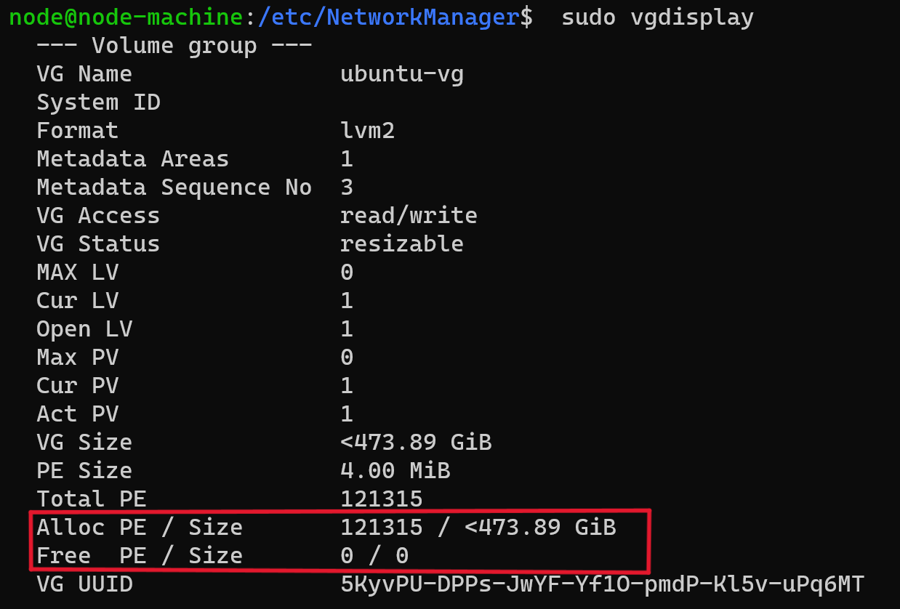

# Part 3 - Settings & Security

In part three, we will update various settings to improve security.

## Step 1 - Configure SSH Server

In this step, the SSH server will be configured. The following keywords will be set:

- `ChallengeResponseAuthentication no` - disables keyboard authentication
- `PasswordAuthentication no` - disables password authentication
- `PermitRootLogin prohibit-password` - disables password and keyboard-interactive authentication for root
- `PermitEmptyPasswords no` - When password authentication is allowed, it specifies whether the server allows login to accounts with empty password strings. The default is no.

### 1.1 - open the configuration file:

Establish an SSH connection to your node machine and run the following command.

```
sudo nano /etc/ssh/sshd_config
```

### 1.2 - configure the settings

Copy the code block below and paste the keywords to the top of the file.

```bash title=/etc/ssh/sshd_config
ChallengeResponseAuthentication no
PasswordAuthentication no
PermitRootLogin prohibit-password
PermitEmptyPasswords no
```

:::note
Challenge-response protocol in SSHv1 `ChallengeResponseAuthentication` has been upgraded to keyboard-interactive authentication protocol in SSHv2 which looks like the following:

`KbdInteractiveAuthentication no`
:::

Save and exit

### 1.3 - validate SSH configuration

Check that the ssdh_config file is valid. If this command results in errors, go back to the last step and double check the changes you made.

```
sudo sshd -t
```

### 1.4 - restart ssh service

```
sudo systemctl restart sshd
```

Close the ssh session

```
exit
```

### 1.5 - test connection

Reconnect to your node machine to verify the settings have not caused any connectivity issues.

## Step 2 - System Update

It is very important to keep your machine updated. In this step we will run a manual update and the configure the machine to automatically update.

### 2.1 - manually update the system

```shell=
sudo apt-get update -y
sudo apt dist-upgrade -y
sudo apt-get autoremove
sudo apt-get autoclean
```

### 2.2 - configure auto-update

```shell=
sudo apt-get install unattended-upgrades
sudo dpkg-reconfigure -plow unattended-upgrades
```

## Step 3 - Disable Root Access

A root access should not be used. Instead, a user should be using sudo to perform privileged operations on a system.

```
sudo passwd -l root
```

## Step 4 - Block Unauthorized Access

Install Fail2ban to block IP addresses that are attempting to access our node. Fail2ban blocks addresses after a certain number of failed attempts.

### 4.1 - install fail2ban

```
sudo apt-get install fail2ban -y
```

### 4.2 - configure fail2ban

Create a config file to monitor ssh logins

```
sudo nano /etc/fail2ban/jail.local
```

Paste the code below into the text editor. Replace `<ssh-port>` to match your ssh port number.

```
[sshd]
enabled=true
port=<ssh-port>
filter=sshd
logpath=/var/log/auth.log
maxretry=3
findtime=300
bantime=28800
ignoreip=
```

Save changes and close the editor

### 4.3 - start the service

```
sudo systemctl daemon-reload
sudo systemctl start fail2ban
sudo systemctl enable fail2ban
sudo systemctl status fail2ban
```

## Step 5 - Improve SSH Connection (Skip if using Ubuntu Server)

**This step is only required for Ubuntu Desktop installations. If you installed Ubuntu Server, you may skip this step.**

WiFi power management may slow down SSH connections. Modifying the config file will disable it.

### 5.1 - open the configuration file

```
sudo nano /etc/NetworkManager/conf.d/default-wifi-powersave-on.conf
```

### 5.2 - modify power setting

Find the wifi.power setting and change to to match the following:

```
[connection]
wifi.powersave = 2
```

Save changes and close the editor.

### 5.3 - restart the service:

```
sudo systemctl restart NetworkManager
```

## Step 6 - Resize Disk Volume (server install only)

**This step is only required for Ubuntu Server installations. If you installed Ubuntu Desktop, you may skip this step.**

The default install of Ubuntu Server does not allocate all of the free disk space to the volume group. Follow these steps to check your system and resize the volume group.

### 6.1 - check the volume group

```
sudo vgdisplay
```

Example Output 
Check the output:

`Alloc PE / Size` shows how much space has been allocated to the volume

`Free PE / Size` shows how much space has not been allocated to the volume.

If `Free PE / Size` is zero, you can skip the rest of step 6

If `Free PE / Size` has a value, execute the commands below

### 6.2 - extend and resize the volume

Execute the two commands below

```
sudo lvextend -l +100%FREE /dev/ubuntu-vg/ubuntu-lv
```

```
sudo resize2fs /dev/mapper/ubuntu--vg-ubuntu--lv
```

Example Output 

### 6.3 - confirm the change

Check the volume group again

```
sudo vgdisplay
```

`Free PE / Size` should now be zero and `Alloc PE / Size` should be the full size of your disk

Example Output 

---

References

- [Vlad's Guide](https://github.com/lykhonis/lukso-node-guide#auto-start)
- [Setup an Eth2 Mainnet Validator System on Ubuntu](https://github.com/metanull-operator/eth2-ubuntu)
- https://man.openbsd.org/sshd_config
